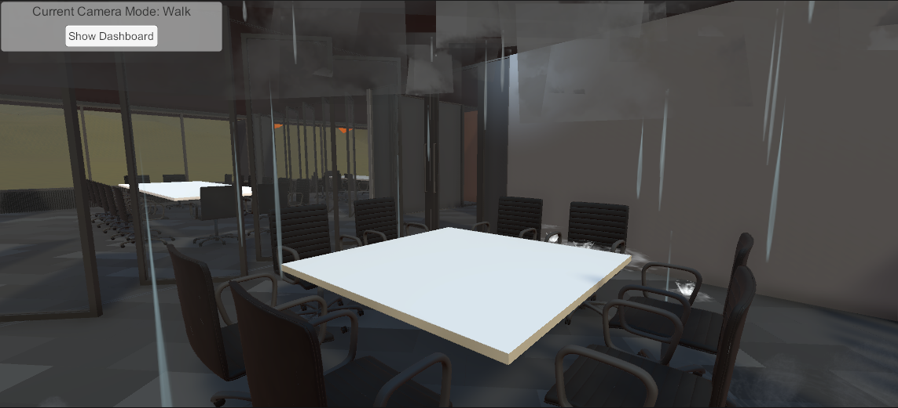
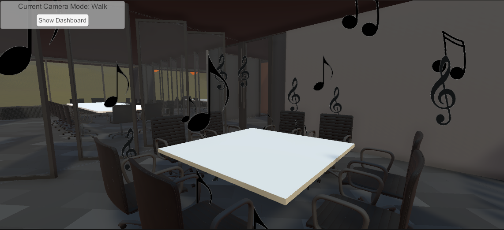
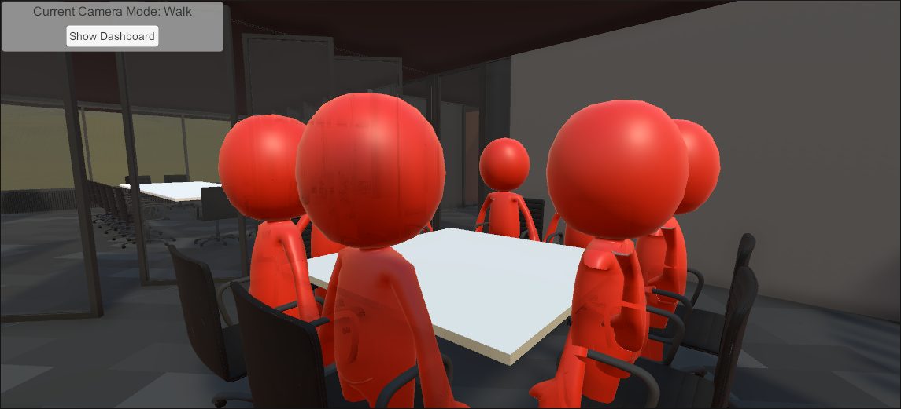
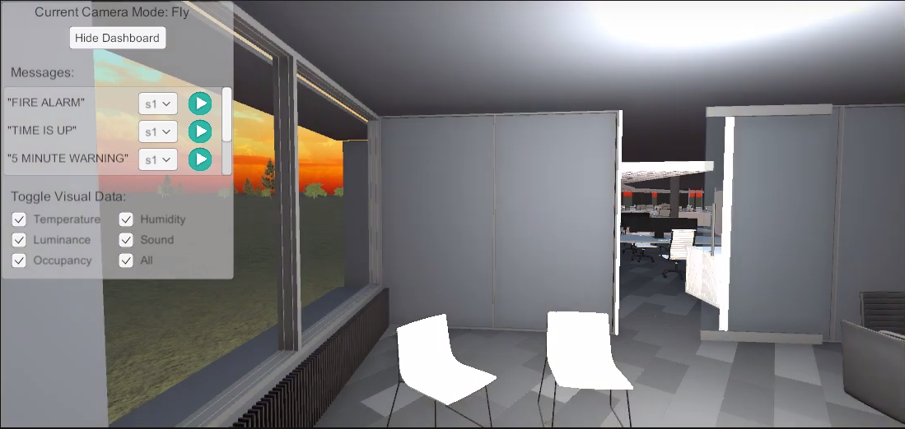
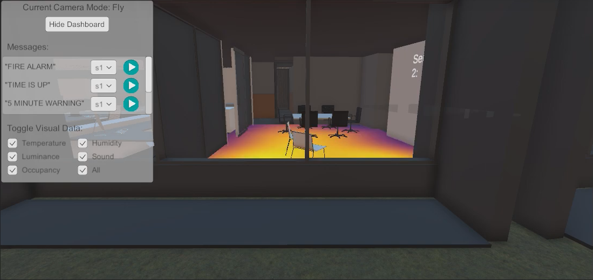
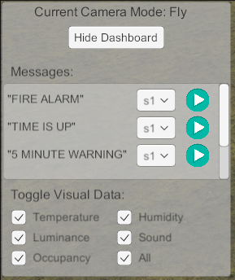

# DeltaControlSensorVR
VR for viewing sensor readings in a building. A connection is used to an external MQTT broker that allows this application to retrieve live sensor readings from Delta Control's O3 sensors and to send commands for those sensors to play pre-recorded messages. Additional sensors can be added by dragging the sensor prefab in the prefab folder into the scene. Only set up required is to set a new tag for the receive in the sensor and setting the prefixes in the receiver.

## Version
This project uses Unity editor 2020 and is compatable with any 2020 build version. Conversion to other versions such as 2019 or 2021 are untested and could potentially break functionality.

## Controls
The camera has movement controls binded to wasd. While q and e allow for vertical movement while in fly mode. Additional controls are:
- Pressing C will switch between walk and fly mode.
- Pressing R will make the curser appear/dissapear, you need a visable curser to interact with the dashboard on the top left corner.
- Pressing F will hide/show the dashboard.

## Visual Data
### Humidity
Humidity is visualized using five levels for quick identification:
- Up to 20%: Occasional droplets falling with no splash on impact.
- 20% to 30%: Frequent droplets with a splash on impact.
- 30% to 50%: Light rain with no splash on impact. This range aligns with Health Canada's recommendation for human health and mould prevention.
- 50% to 60%: Heavy rain with splashes on impact.
- Above 60%: Very heavy rain with splashes on impact and thunder clouds.

     
    <em>Figure 1 - Visualization of humidity at over 60%</em>

### Sound
To depict sound, a range of musical notes emanate from the center of the room, with the emission rate of notes changing based on noise readings at every increment of 10dB. Additionally, there are three sizes of musical notes corresponding to different sound levels:
- Small notes: Representing noises up to whispering, these notes are emitted for noise levels up to 40dB.
- Medium-sized notes: Representing sounds up to conversations, these notes are emitted for noise levels ranging from 40dB to 80dB.
- Large-sized notes: Representing very loud conversations and louder noises, these notes are emitted for noise levels above 80dB.

     
    <em>Figure 2 - Visualization of sound at over 80dB</em>

### Occupancy
The number of occupants is represented by basic 3D stickman avatars at each seat present in the room. When a change occurs in occupancy, the avatars will fade in/out to match the new reading value. Once maximum occupancy is reached, no additional avatars will fade in with further increases to occupancy. To allow quick identification of room occupancy, the colour of the avatars change to represent how occupied the room is:
- Green: The room is at ¼ capacity or below.
- Yellow: The room is between ¼ capacity and ¾ capacity.
- Orange: The room is above ¾ capacity but not full.
- Red: Occupancy limit reached.

     
    <em>Figure 3 - Visualization of occupancy at full capacity</em>

### Luminance
In order to show luminance, the rooms are naturally dim inside with a single light source from the sensor. This is implemented in five levels, with each incrementing level having a larger area of influence, higher intensity, and a hue closer to pure white light (yellowish hue at lowest level). The levels are: below 50 lux, 50 lux to under 200 lux, 200 lux to below 500 lux, 500 lux to below 2000 lux, and 2000 lux and above. Each additional change requires a larger increase in lux as it requires larger increments to observe more brightness from light sources.

     
    <em>Figure 4 - Visualization of luminance at over 2,000 lux</em>

### Temperature
Temperature is visualized using a heat map that is displayed on the floor of the room containing the sensor. This is also implemented in five different levels with each increasing level displaying a more red heatmap. The pattern of the heat map is randomly generated when building the software interface, and the pattern will remain the same in future usages for easier user recognition. The five temperature levels are any temperature below 10°C, from 10°C to 15°C, from 15°C to 20°C, from 20°C to 25°C and any temperature above 25°C. The middle level, which is from 15°C to 20°C is selected to be slightly below an ideal room temperature.

     
    <em>Figure 5 - Visualization of heat map at 15 degrees celsius</em>

## Dashboard
The dashboard contains two sections, sending voice commands (control pannel) and toggling sensor data.

     
    <em>Figure 6 - Extendable dashboard that sits fixed on top left corner</em>

### Control Pannel
The control pannel contains a list of voice commands that can be sent to a sensor. Each command contains a drop down to select the sensor and a play button to send the command. The drop down is currently hard coded to send to sensor 1, sensor 2, or all. These drop down options can be dynamically assigned by editing it in Scripts/Dashboard/PlayMessages.cs before or after the event listener is added. 

When pressing the play button, it will send the command using a MQTT connection and the play icon becomes a reload icon indefinetly unless the drop down value changes.

### Toggling sensor data
The section contains checkmarks to indicate which sensor visualizations are active. They can each be independtly selected to turn on/off. The all option will select all if checked and of all options are selected, toggling it off will turn off all visualization.

## Troubleshooting
### Sensor text not changing display
First make the sure that console messages indicate that the broker connection the MQTT as been established. If this issue persitists with MQTT set up properly then use the text1 prefab in the prefabs folder. Simply drag it to the desired sensor then copy all of the configured settings from the original text object to the new one. This issue has occurred and been solved using this process durring testing.

### Prefab for sensor has purple/pink heatmap
Check the material for the tempurature display, if it is empty, assign it the heatmap material. Alternatively, a new sensor can be added by copying and pasting an already existing sensor.

## Asset Packs
A variety of asset packs were used in creating the Unity scene. All asset packs used with their lisences can be found in the assets fo the project.
